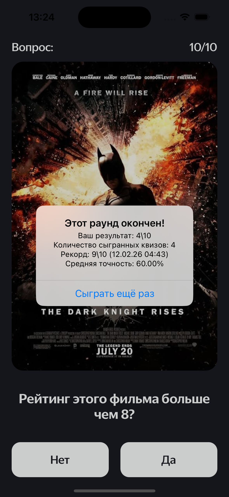

# 🎬 RateFrame

RateFrame — киноквиз, который сам придумывает вопросы.
Приложение берёт реальный рейтинг IMDb и динамически генерирует вопрос:
«Рейтинг этого фильма больше 7?» — хотя оригинальный рейтинг, допустим, 8.1.

## 🕹 Как играть

- Тебе показывают кадр из топ-250 IMDb
- Вопрос: рейтинг фильма больше 6? (или другое число)
- Нажимаешь «Да» или «Нет»
- Рамка становится зелёной ✅ или красной ❌
- Через 1 секунду — следующий вопрос
- После 10 вопросов — статистика: рекорд, точность, дата лучшей игры

## 🧠 Почему это интересно:
Код не берёт вопросы из списка. Он каждый раз пересчитывает рейтинг фильма, округляет, прибавляет или отнимает 1–2 балла.
Игрок не угадывает — он вычисляет, обманул его код или нет.

| Вопрос | Ответ | Результат |
|--------|--------|-----------|
|  |  |  |

## 🚀 Как запустить

> **Важно:** Для запуска приложения необходим Xcode (только на macOS).
> Если у вас Windows или Linux — запустить проект не получится 😔

1. Скачайте проект ZIP-архивом (зелёная кнопка Code → Download ZIP) или
[Скачать ZIP архив](https://github.com/MariahRevina/RateFrame/archive/refs/heads/main.zip)

2. Распакуйте и дважды кликните `MovieQuiz.xcodeproj`

3. Выберите симулятор iPhone (например, iPhone 15) и нажмите Run

## 📱 Запуск на реальном iPhone

1. Подключите iPhone к Mac через кабель
2. В Xcode выберите своё устройство вместо симулятора
3. Нажмите кнопку Play (▶️)
4. **Важно!** Xcode покажет ошибку подписи — нажмите "Trust" на iPhone, когда появится запрос
5. В настройках iPhone: **Настройки → Основные → VPN и управление устройством** → выбрать свой Apple ID → нажать "Доверять"
6. Запустите приложение снова

## 📋 Требования для запуска

- Xcode 14.0+ (скачать можно бесплатно из App Store)
- macOS Ventura 13.0+ или новее
- iOS 15.0+ (для запуска на реальном устройстве)

## 🛠 Стек

- Swift, UIKit 
- MVP — логика в MovieQuizPresenter, View только рисует
- URLSession — загрузка топ-250 IMDb, обработка ошибок, повтор запроса
- UserDefaults — рекорды, точность, даты игр
- XCTest — Unit-тесты презентера, UI-тесты, моки, Given-When-Then
- Кастомные расширения — safe subscript, date formatting
